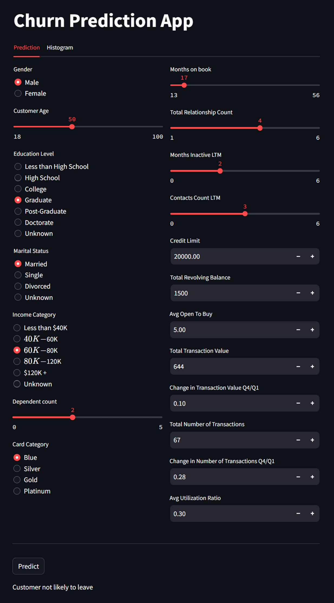
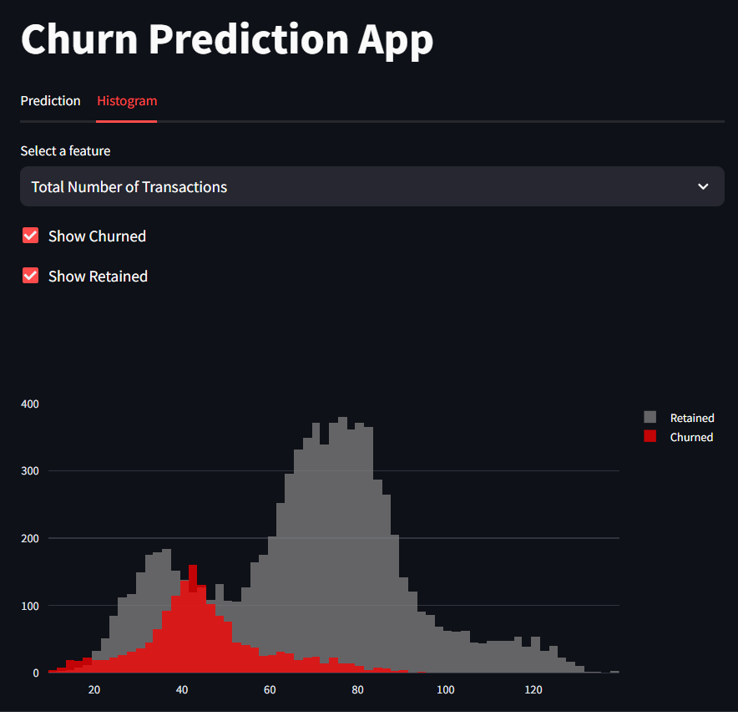

# Churn Prediction App

This is a Streamlit application for predicting customer churn. The app allows users to input customer data and predicts whether a customer is likely to leave or stay.

## Files

- `churnpredictionapp.py`: The main Streamlit application file.
- `Model.ipynb`: Notebook with detailed steps of development of the machine learning model.
- `model.pkl`: The pre-trained machine learning model used for predictions.
- `BankChurners.csv`: The dataset used for training the model (if applicable).
- `requirements.txt`: The list of Python dependencies required to run the app.

## Example

Here is an example of the Churn Prediction App in action:




## Installation

1. Clone the repository:
    ```sh
    git clone <repository-url>
    cd <repository-folder>
    ```

2. Create a virtual environment and activate it:
    ```sh
    python -m venv venv
    .\venv\Scripts\activate  # On Windows
    source venv/bin/activate  # On macOS/Linux
    ```

3. Install the required dependencies:
    ```sh
    pip install -r requirements.txt
    ```

## Usage

1. Run the Streamlit app:
    ```sh
    streamlit run churnpredictionapp.py
    ```

2. Open your web browser and go to `http://localhost:8501` to view the app.

## Features

- **Prediction Tab**: Input customer data and predict whether the customer will churn.
- **Histogram Tab**: Visualize the distribution of various features for churned and retained customers.


## License

This project is licensed under the MIT License.


